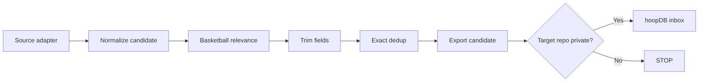
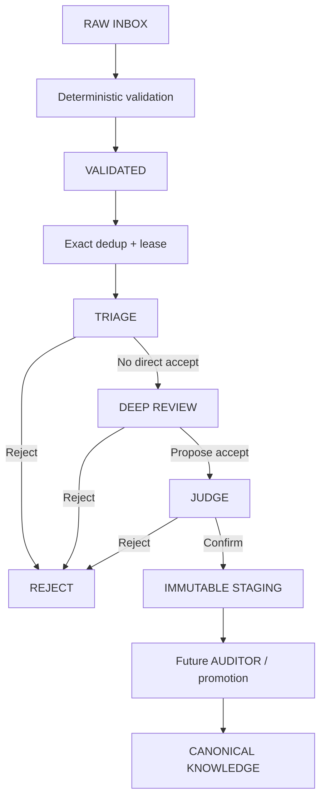
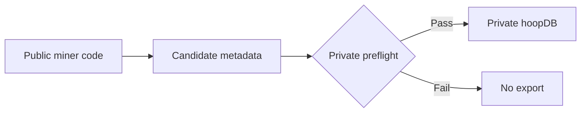

<div align="center">

# ⛏️ Basketball Knowledge Miner

### Collect broadly. Promote carefully.

농구 자료를 많이 모으되, **아무 자료나 바로 FormPath 지식으로 승격시키지 않는 공개 수집·검증 파이프라인**입니다.

<p>
  
  
  
  
</p>

[Collection](#collection-pipeline) · [Daily Target](#daily-target) · [Miner Live](#miner-live) · [Distillation V3](#distillation-v3) · [Safety Boundary](#public--private-boundary) · [Run](#development)

</div>

---

## What this repo does

이 저장소는 **수집과 1차 정리**를 담당합니다. 실제 candidate payload는 비공개 `Rudwpahs/hoopDB`로 넘기고, 여기서는 공개 가능한 코드·상태·fixture만 관리합니다.

### V1 sources

- Crossref 학술 메타데이터
- 명시적으로 허용한 YouTube 코칭 / 전문가 채널
- 같은 provenance·rate-limit·fixture 검증을 통과한 추가 공식/API 소스

### Explicitly out of scope

Reddit 전체 스크래핑, paywall 우회, anti-bot 우회, 원본 영상, 전체 transcript, 전체 저작권 기사, private FormPath 연구 내용은 수집 대상이 아닙니다.

## Collection pipeline



목표는 많이 긁어오는 것이 아니라 **출처가 남고, 중복이 줄어들고, 공개/비공개 경계를 넘지 않는 후보 데이터**를 만드는 것입니다.

## Daily target

production Miner는 매시간 `07`, `27`, `47`분에 실행 기회를 가집니다. 각 실행은 `config/miner_target.json`의 `daily_target`을 읽고, 서울 날짜 기준 오늘 누적 수집량이 목표에 도달하면 source API 호출 전에 즉시 종료합니다.

목표량을 바꾸려면 Python 코드나 workflow를 수정하지 않고 `config/miner_target.json`의 `daily_target` 숫자 하나만 변경합니다.

| Item | Current setting |
|---|---|
| Wake-up cron | `7,27,47 * * * *` UTC |
| Quota timezone | `Asia/Seoul` |
| Inspection budget / run | up to 20,000 source records |
| Daily export target | `config/miner_target.json` |

마지막 실행에서는 남은 quota보다 더 많은 source record를 fetch하지 않기 때문에 목표량을 넘기기 위해 checkpoint를 앞당기지 않습니다. GitHub cron 지연, 외부 API rate limit, 실제 관련 후보 공급량에 따라 특정 날짜의 실제 수집량은 목표보다 적을 수 있습니다.

## Miner Live

공개 dashboard는 후보 원문이 아니라 다음 **집계값만** 보여줍니다.

- 현재 총 수집 데이터
- 증류 대기
- 증류 성공
- 오늘 수집량 / 오늘 목표량
- 최근 7일 일별 수집량
- 마지막 Miner 실행 시각
- 마지막 증류 성공 시각
- 현재 시스템 상태

브라우저는 같은 origin의 `status.json`만 읽습니다. candidate title, URL/DOI, author, summary, candidate ID, canonical hash, queue ID, knowledge-unit text는 공개 asset에 포함하지 않습니다. GitHub Actions가 private `Rudwpahs/hoopDB`를 서버측에서 읽고 숫자로 축약한 뒤 GitHub Pages에 배포합니다.

status는 5분 주기로 reconcile되고, 브라우저는 60초마다 최신 `status.json`을 다시 확인합니다. 새 상태를 읽지 못하면 화면에 `STALE`을 표시합니다.

## Distillation V3

V3 core는 의미 판단을 직접 하지 않고 **각 단계가 할 수 있는 행동을 제한**합니다.



### Hard rules

- raw inbox → canonical 직접 이동 금지
- Triage는 `ACCEPT` 불가
- Deep의 `PROPOSE_ACCEPT`만으로 승인 불가
- Judge의 `CONFIRM` 필요
- staging은 동일 byte 재시도만 허용, 내용이 바뀐 overwrite 거부
- 실제 canonical promotion은 future Auditor integration만 수행

## Public ↔ Private boundary



`miner`는 public, 실제 후보 저장소인 `hoopDB`는 private이라는 경계를 유지합니다. Miner Live도 candidate payload를 공개하지 않고 allowlist된 집계 숫자만 Pages artifact에 넣습니다.

## Development

```bash
python -m pip install -e ".[dev]"
python -m pytest -q
python -m ruff check src tests scripts
```

수집만 확인하려면:

```bash
python scripts/run_miner.py --budget 50 --no-export
```

V3 dry-run:

```bash
python scripts/run_distill_v3.py \
  --inbox-jsonl tests/fixtures/v3/inbox.jsonl \
  --state-dir _v3_state \
  --batch-size 100 \
  --dry-run
```

현재 dry-run은 semantic ACCEPT, canonical write, private repository write, GPU 실행을 하지 않습니다.

운영 설정과 secret 권한, live-export gate는 `docs/OPERATIONS.md`에 정리되어 있습니다.
